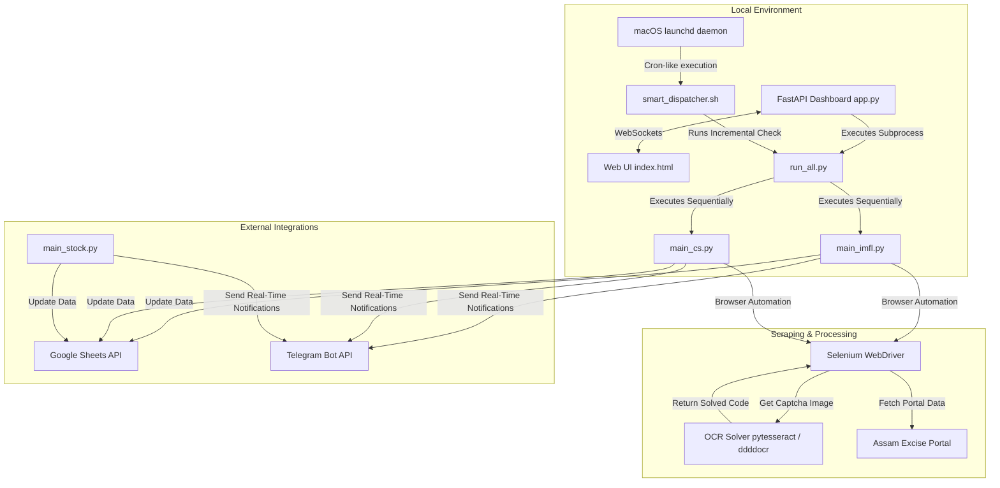

# Liquor Bond Automation Suite

A robust, enterprise-grade automated data extraction and sync engine for tracking liquor endorsements and stock data from the Excise Portal. The suite executes headless browser scraper runs, solves captcha challenges using local OCR models, updates Google Sheets, alerts stakeholders via Telegram, and exposes an interactive local web dashboard.

---

## 🏗️ System Architecture

The suite connects multiple components in a modular, event-driven layout:



---

## 📂 Project Directory Structure

The repository has been clean-structured into functional layers for readability and ease of maintenance:

```
├── app.py                      # FastAPI log-streaming server backend
├── run_web_server.sh           # Shell runner for the dashboard web server
├── run_web_server.bat           # Windows batch runner for the dashboard web server
├── requirements.txt            # Logical grouped Python dependency file
├── .gitignore                  # Custom file exclusions (logs, caches, secrets, artifacts)
│
├── config/
│   └── config.json             # Application settings (Telegram tokens, user settings) [Git-Ignored]
├── data/
│   ├── cookies_cs.json         # Runtime portal session cache [Git-Ignored]
│   └── endorsed_trucks_1_12.xlsx # Local backup dataset
├── keys/
│   └── liquorbond-service.json # Google Cloud Service Account credentials [Git-Ignored]
├── static/
│   └── index.html              # HTML/JS frontend code for the local dashboard
│
├── scripts/                    # PRODUCTION EXECUTABLE LAYER
│   ├── automation_utils.py     # Core functions (Driver setup, Captcha solving, Reports generator)
│   ├── liquor_data.py          # Data parsing and validation helpers
│   ├── main_imfl.py            # Indian Made Foreign Liquor (IMFL) automation script
│   ├── main_cs.py              # Country Spirit (CS) automation script
│   ├── main_stock.py           # Stock management/verification automation script
│   ├── run_all.py              # Sequentially runs both IMFL & CS scraper scripts
│   ├── run_automation.sh       # Main wrapper shell script with process concurrency lock
│   ├── run_daily_report.sh     # Shell script forcing cumulative daily report creation
│   └── smart_dispatcher.sh     # Time-aware incremental cron runner
│
├── scheduling/                 # macOS DAEMON SCHEDULING LAYER
│   ├── com.liquorbond.automation.plist # LaunchAgent scheduler XML template
│   ├── fix_launchd_path.sh     # Resolves paths and installs launchd service
│   ├── setup_automation.sh     # Installs 15-min interval cron runner and wakes system daily
│   └── setup_schedule.sh       # Installs 45-min interval cron runner and wakes system daily
│
└── tests/                      # DIAGNOSTICS & VERIFICATION LAYER
    ├── check_duplicates.py     # Verifies no duplicate rows exist in Google Sheets
    ├── debug_captcha.py        # Sandbox to test OCR threshold configurations
    ├── debug_imfl_missing.py   # Simulates IMFL login flows to catch anomalies
    ├── debug_server.py         # Sandbox verifying Selenium launch capabilities
    ├── debug_server_chrome.py  # Sandbox verifying headless Selenium-Chrome compatibility
    ├── debug_sheet.py          # Validates Google Sheets read-write permissions
    ├── fetch_test.py           # Tests network level connectivity to portal
    ├── fix_checkpoint.py       # Diagnostic script to fix corrupted local JSON state
    ├── flush_stock_data.py     # Debug runner to clear stock cache checkpoints
    ├── reproduce_telegram_order.py # Tests Telegram report message ordering
    ├── test_add_column.py      # Verifies Google Sheets column addition capabilities
    ├── test_bug_fix.py         # Sandbox validating WhatsApp summary reports logic
    ├── test_google_sheets.py   # Verifies read-write permissions to active sheet worksheets
    ├── test_ocr.py             # Diagnostic checklist of Tesseract and Pillow setup
    └── test_telegram_local.py  # Diagnostic checking Telegram bot messaging connectivity
```

---

## ⚙️ Initial Local Setup

### 1. Prerequisites
- **Python:** Python 3.12 is recommended.
- **Tesseract OCR (System dependency):** Tesseract must be installed on your machine for the captcha solver.
  - **macOS:** `brew install tesseract`
  - **Linux (Ubuntu/Debian):** `sudo apt-get install -y tesseract-ocr`

### 2. Installation
Clone the repository and set up a virtual environment:
```bash
# Initialize virtual environment
python -m venv env

# Activate environment
source env/bin/activate  # On Windows: env\Scripts\activate

# Install dependencies
pip install -r requirements.txt
```

### 3. Service Account Credentials
Generate a Service Account key from Google Cloud Console with permissions to edit your target spreadsheet. Save the JSON file in `keys/liquorbond-service.json`.

### 4. Configuration
Create `config/config.json` with the following variables:
```json
{
  "TELEGRAM_BOT_TOKEN": "YOUR_TELEGRAM_BOT_TOKEN",
  "TELEGRAM_CHAT_ID": "YOUR_TELEGRAM_CHAT_ID",
  "PORTAL_URL": "YOUR_EXCISE_PORTAL_URL"
}
```

---

## 🖥️ Running the Web Dashboard

Expose the real-time execution log streamer:
```bash
./run_web_server.sh   # On Windows: run_web_server.bat
```
Navigate to `http://localhost:8000` to trigger scrapers manually, toggle headless options, configure execution flags, and view real-time standard output log logs via WebSockets.

---

## ⏰ macOS Automated Scheduling (launchd)

 macOS launchd scheduler configurations are located in `scheduling/`:

### Option A: Regular Checking Schedule (45-min intervals, 18 runs daily)
Schedules runs between 11:00 AM and 11:45 PM, and schedules a system wake-up at 9:15 PM to ensure cumulative day-end reports run:
```bash
chmod +x scheduling/setup_schedule.sh
./scheduling/setup_schedule.sh
```

### Option B: High-Frequency Schedule (15-min intervals, all-day)
Schedules scraper checks every 15 minutes and wakes the system up at 9:25 PM daily:
```bash
chmod +x scheduling/setup_automation.sh
./scheduling/setup_automation.sh
```

---

## 🧪 Diagnostics & Sandbox Testing

Run diagnostic tests inside the virtual environment to verify configurations:

- **Verify OCR & Tesseract Setup:**
  ```bash
  python tests/test_ocr.py
  ```
- **Verify Google Sheets Connection:**
  ```bash
  python tests/test_google_sheets.py
  ```
- **Verify Telegram Delivery:**
  ```bash
  python tests/test_telegram_local.py
  ```
- **Check Sheet Duplicates:**
  ```bash
  python tests/check_duplicates.py
  ```
